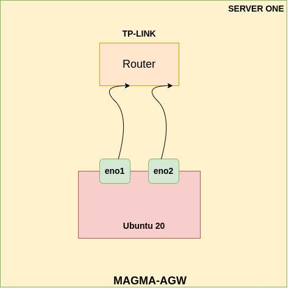
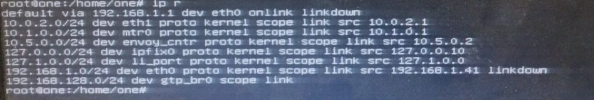
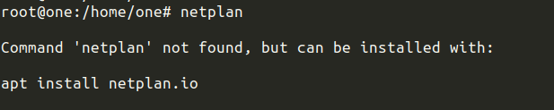

# Magma-AGW-Tutorial
Deployment of Magma Access Gateway on Baremetal

### System Info:(Used Server One)
* Ubuntu 20
* 2 Network Interfaces
* Isolated Network
* Used Embedded NICs(eno1,eno2)

### The Network Architecture using right now:


### Prerequisites:
* Static ip on eno2 is must
* agw_install_ubuntu.sh file should be on the root directory

### Follow The Steps:
* Use the /etc/netplan/00-installer-config.yaml file  like [this](./netplan/00-installer-config-before.yaml):

```bash
network:
  ethernets:
    eno1:
      addresses: [192.168.1.41/24]
      gateway4: 192.168.1.1
      nameservers:
        addresses: [8.8.8.8, 8.8.4.4]
    eno2:
      addresses: [192.168.1.42/24]
      gateway4: 192.168.1.1
      nameservers:
        addresses: [8.8.8.8, 8.8.4.4]
```

* Go to the `root` directory where the file is located.
* Now, Run the script
```bash
bash agw_install_ubuntu.sh 192.168.1.41/24 192.168.1.1
```
`eno`: `192.168.1.41/24` & `gateway`: `192.168.1.1`

> Script will reboot the system.

* Check whether the services has been started or not

```bash
sudo service magma@* status
```

Now you can check that interfaces name of `eno1` & `eno2` have been changed to `eth0` & `eth1`
> Some more interfaces will also appear like `gtp_br0` , `li_port` ,etc.

### Networking Issue after the deployment.
* After the deployment interfaces may be down.


* Unable to access the internet.
* netplan may also be not working.


**To fix these issues:**

* Change the /etc/netplan/00-installer-config.yaml like [this](./netplan/00-installer-config-after.yaml):

* Inside the file, change the interface name of `eno1` & `eno2` to `eth0` & `eth1`.

* Provide dynamic IP to both the interfaces.

```bash
network:
  ethernets:
    eth0:
      dhcp4: true
    eno1:
      dhcp4: true
```

* Save the file and then `reboot` the system.
```bash
sudo reboot now
```
After the reboot, networking is back to normal.
> Also, check the default route is provided or not